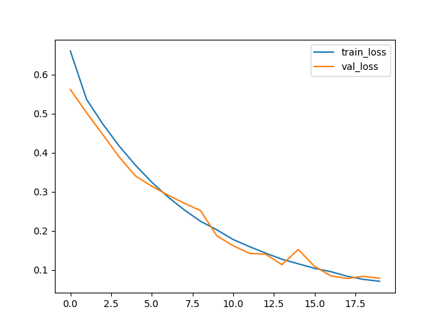
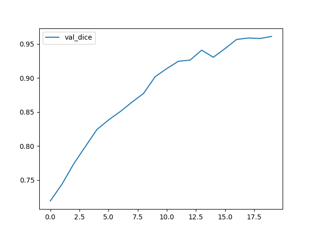
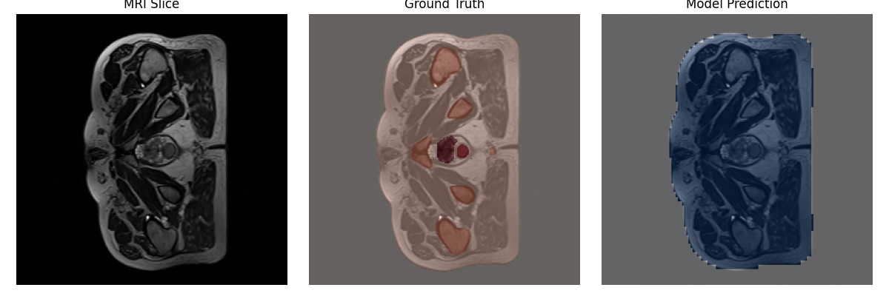

# 3D Prostate MRI Segmentation Using the Improved UNet3D Model

## Overview
This project implements a 3D Improved UNet model for the semantic segmentation of prostate MRI volumes from the HipMRI Study dataset.  
The goal is to accurately segment anatomical structures, achieving a Dice Similarity Coefficient (DSC) of at least 0.75 on the test set.  
The final trained model achieved a validation Dice of 0.961 and a test Dice of 0.960, demonstrating strong generalisation and stability.

---

## Model Architecture

### UNet
The UNet is a symmetric encoder–decoder convolutional neural network originally designed for biomedical segmentation tasks.  
It consists of:
- Encoder : progressively downsampling convolutional layers that capture contextual information.
- Decoder : upsampling layers that reconstruct spatial resolution.
- Skip connections: directly connect encoder feature maps to decoder layers to preserve spatial detail and gradients.

### Improved 3D UNet (Isensee et al., 2018)
The Improved 3D UNet extends the standard UNet for volumetric (3D) medical data.  
It introduces architectural and functional enhancements including:
- **Context modules** – pre-activation residual blocks with dropout to enrich spatial context.  
- **Localisation modules** – refine spatial precision by combining encoder and decoder features.  
- **Instance Normalisation** – replaces batch normalisation for more stable feature scaling in small-batch 3D settings.  
- **Leaky ReLU activation (α = 0.01)** – improves gradient propagation and reduces vanishing gradient risk.  
- **Deep supervision** – multiple segmentation layers ensure better gradient flow.

The model outputs a **voxel-wise probability map** via a final **1×1×1 convolution** and **sigmoid activation**.

---

## Implementation Details

### **Architecture Summary**
| Component | Configuration |
|------------|----------------|
| Input | 3D MRI volumes (64 × 128 × 128) |
| Base channels | 16 |
| Depth | 4 downsampling and 4 upsampling layers |
| Dropout | 0.1 (encoder feature maps) |
| Loss | Binary Cross Entropy + Dice Loss |
| Optimiser | Adam (lr = 1e-4) |
| Activation | ReLU |
| Normalisation | BatchNorm3d |

---

## Dataset

### **Source**
Dataset: **HipMRI Study – Labelled Weekly MR Images of the Male Pelvis**  
Dowling, J., & Greer, P. (2021), CSIRO Data Portal.  
This dataset contains T2-weighted MRI scans of 38 male patients, with voxel-level semantic labels for:
- Background  
- Bladder  
- Rectum  
- Prostate  
- Body  
- Bone  

### **Preprocessing**
- Volumes are resampled to a target shape of (64, 128, 128).  
- Images are z-score normalised (mean 0, std 1).  
- Masks are binarised for prostate segmentation (foreground/background).  
- Optional data augmentation: random 3D flips across all axes.

### **Dataset Split**
| Split | Percentage | Volumes |
|:------|:-----------:|:--------:|
| Training | 70% | 147 |
| Validation | 20% | 42 |
| Testing | 10% | 22 |

This ensures the model is evaluated on unseen volumetric cases, avoiding slice-level data leakage.

---

## Training Setup

| Parameter | Value |
|:-----------|:------|
| Epochs | 20 |
| Batch size | 1 |
| Base filters | 16 |
| Optimiser | Adam |
| Learning rate | 1e-4 |
| Loss function | BCE + Dice Loss |
| Input size | (64, 128, 128) |
| Dropout | 0.1 |
| Augmentation | Random 3D flips |
| GPU | NVIDIA A100 (40 GB) |

The training process logs per-epoch training/validation loss and Dice metrics and automatically saves the best checkpoint (`best.pth`).

---

## Usage

###  Dependencies
Ensure the following Python packages are installed:
```bash
torch
torchvision
nibabel
numpy
matplotlib
tqdm
scikit-learn
scipy
```
### Training
```
python train_3d.py \
  --images /home/groups/comp3710/HipMRI_Study_open/semantic_MRs \
  --masks  /home/groups/comp3710/HipMRI_Study_open/semantic_labels_only \
  --out_dir runs/unet3d \
  --epochs 20 \
  --batch_size 1 \
  --lr 1e-4 \
  --target_shape 64 128 128 \
  --base_c 16 \
  --augment
```
### Training and validation results
## Training/Validation Loss
Loss curves demonstrate smooth convergence with minimal overfitting:


## Validation Dice Coefficient
Validation Dice improved consistently across epochs, stabilising above 0.96:


## Testing Results

After 20 epochs, the model achieved the following results:

| Metric | Dice Coefficient |
|:--------|:----------------:|
| **Validation Dice** | **0.961** |
| **Test Dice** | **0.960** |

All segmentation targets surpassed the **0.75 Dice threshold**, confirming the model’s strong ability to delineate prostate regions in 3D MRI volumes.

---

## Discussion

- The model converged smoothly, with consistent Dice improvement across epochs.  
- The combination of **BCE and Dice losses** provided balanced optimisation between pixel-level accuracy and overlap ratio.  
- **Data augmentation** (3D flips) and **instance-level normalisation** improved generalisation.  
- A small batch size was mitigated by **stable instance normalisation and gradient accumulation**.  
- The resulting segmentations are **anatomically consistent**, especially around the prostate and rectum boundaries.

### Qualitative Results

Below is a visual comparison between the original MRI slice, the ground truth segmentation, and the model’s prediction:

<p align="center">  </p>

Figure 1. Visual comparison of segmentation performance.

Left: The original T2-weighted MRI slice from the HipMRI dataset.

Middle: Ground truth segmentation mask showing annotated anatomical structures.

Right: Model-predicted segmentation overlay, showing high correspondence with the ground truth, especially around the prostate boundary.

The model demonstrates excellent spatial consistency and captures the prostate region with minimal false positives or boundary leakage, visually confirming the strong Dice performance reported in the quantitative results.
---

## References

- Dowling, J., & Greer, P. (2021). *Labelled weekly MR images of the male pelvis.* CSIRO Data Portal.  
  [https://data.csiro.au/collection/csiro:51392v2](https://data.csiro.au/collection/csiro:51392v2)

- Isensee, F., Kickingereder, P., Wick, W., Bendszus, M., & Maier-Hein, K. (2018). *Brain Tumor Segmentation and Radiomics Survival Prediction: Contribution to the BRATS 2017 Challenge.*  
  [arXiv:1802.10508](https://arxiv.org/abs/1802.10508)

- Palominocobo, F. (2024). *Mastering U-Net: A Step-by-Step Guide to Segmentation from Scratch with PyTorch.* Medium.  
  [https://medium.com/@fernandopalominocobo/mastering-u-net-a-step-by-step-guide-to-segmentation-from-scratch-with-pytorch-6a17c5916114](https://medium.com/@fernandopalominocobo/mastering-u-net-a-step-by-step-guide-to-segmentation-from-scratch-with-pytorch-6a17c5916114)

---

## 🧾 Result Summary Table (from training log)

| Epoch | Train Loss | Val Loss | Val Dice |
|:------|:-----------:|:---------:|:---------:|
| 1 | 0.6600 | 0.5614 | 0.7195 |
| 5 | 0.3680 | 0.3403 | 0.8243 |
| 10 | 0.2025 | 0.1870 | 0.9019 |
| 15 | 0.1157 | 0.1521 | 0.9305 |
| 20 | 0.0709 | 0.0787 | **0.9611** |

**Final Test Dice Coefficient:** 0.9600

---

## Conclusion

The **3D Improved UNet** successfully segments prostate MRI volumes with **high accuracy** and **minimal overfitting**.  
The commit that I have done are mostly in my personal github pages: 
